# Intern Presentation
At the end of this internship, I partnered with my colleague to give an overview of our expereince at Blue Cross and discussed one of the projects we worked on during our time there.

## Project Tracker Presentation
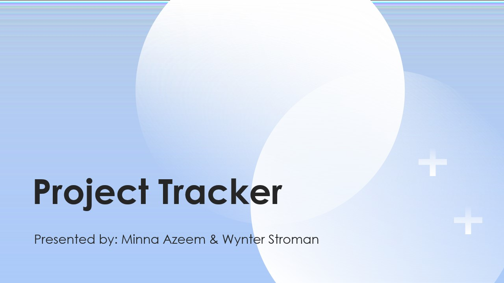
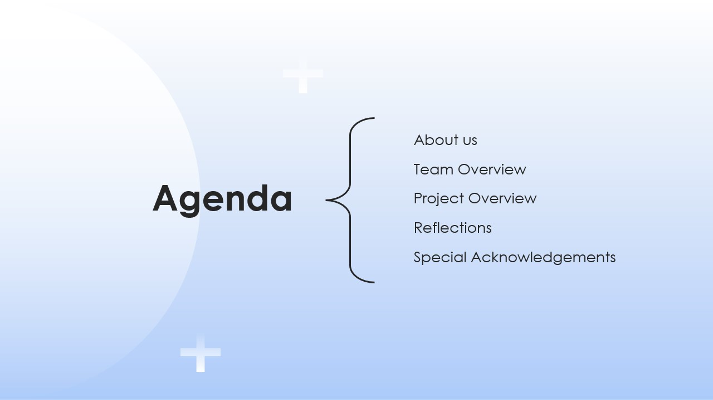
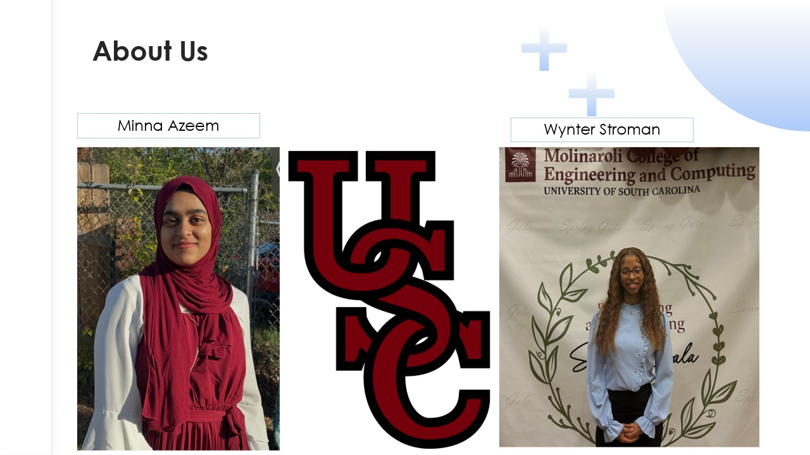
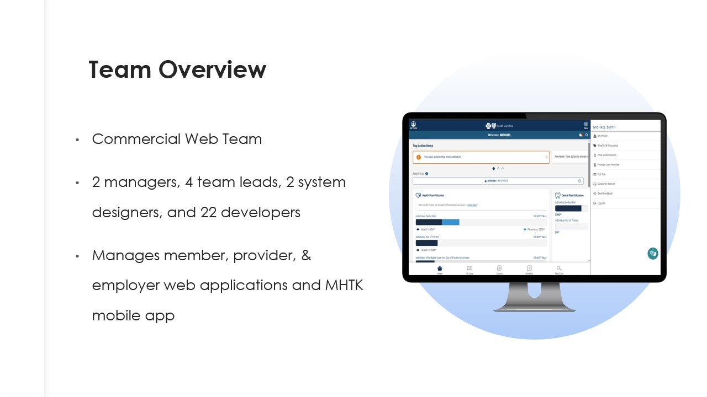
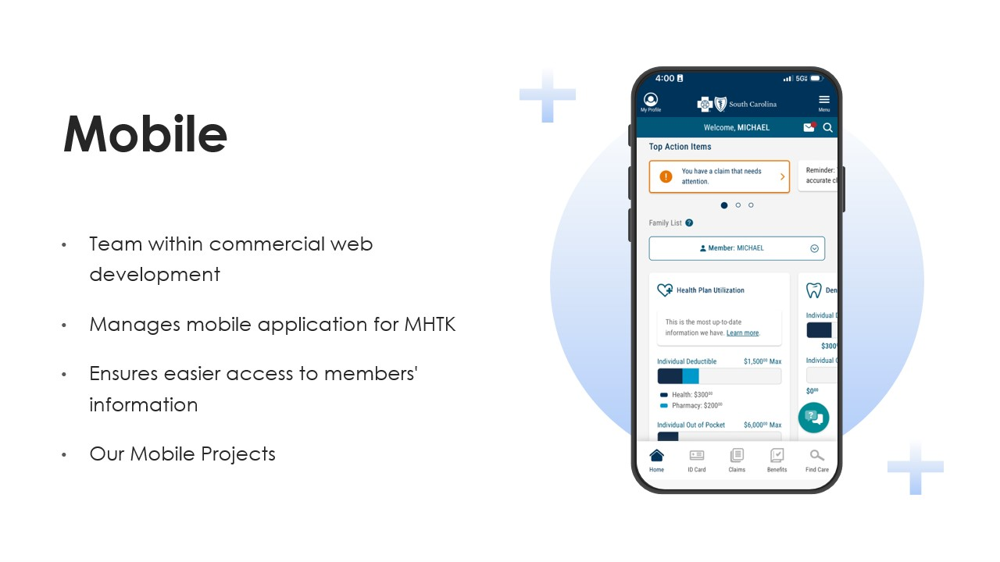
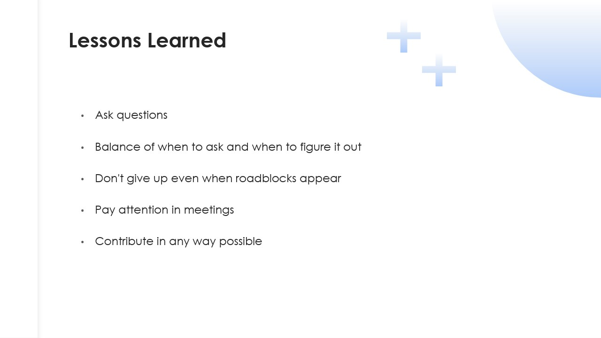
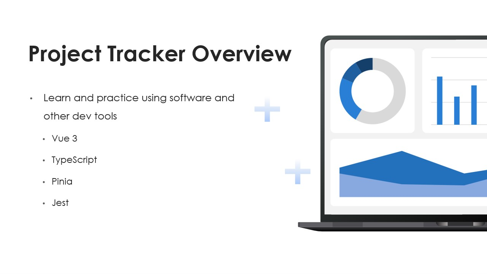
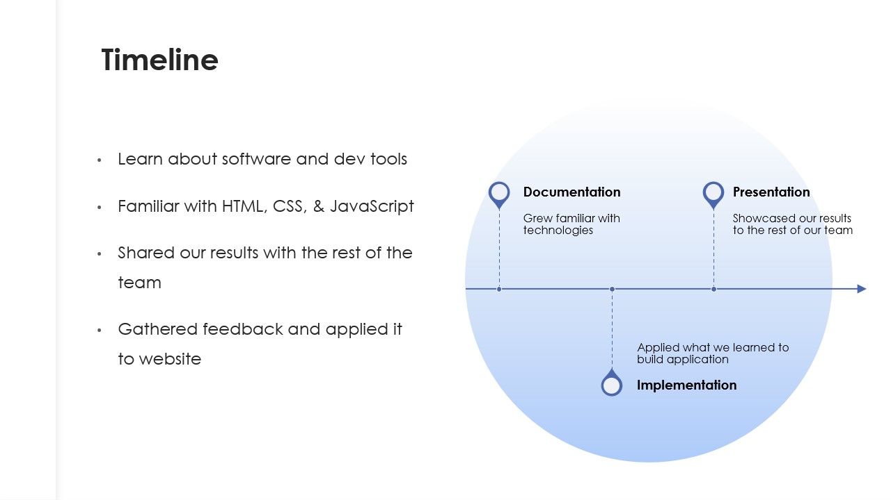
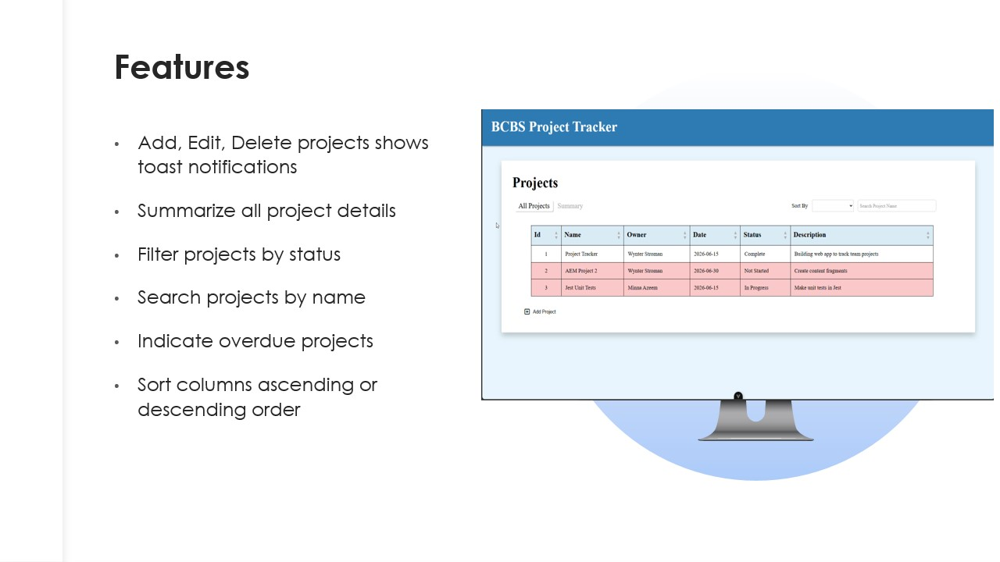
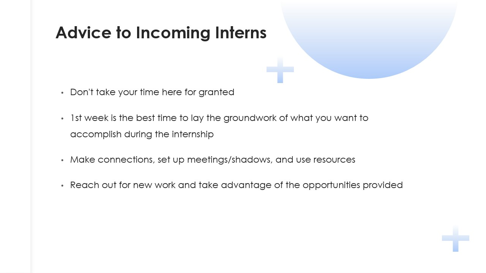
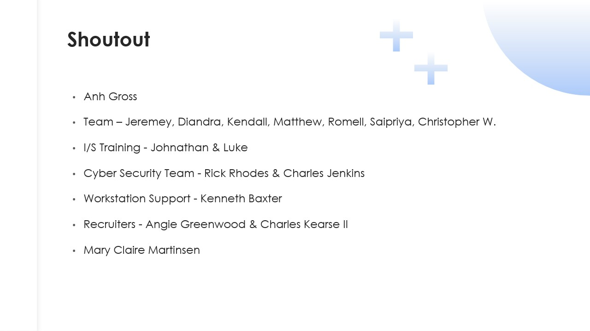
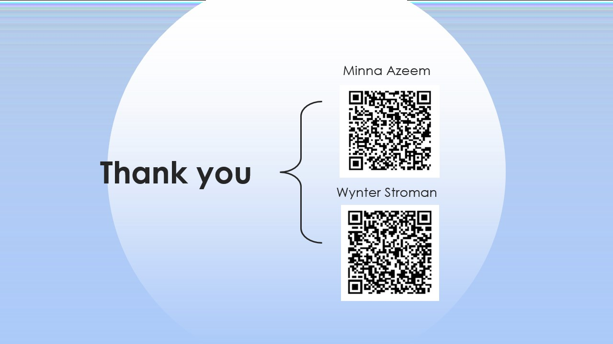